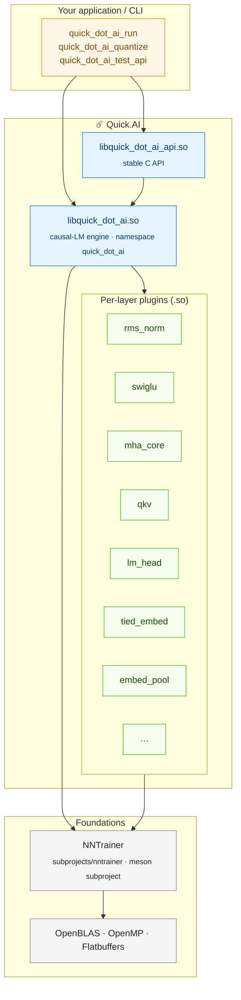

# Quick.AI Architecture

This document describes how Quick.AI is layered, what each binary and `.so` is for, and how the build wires everything together. For a top-level intro, see the [project README](../README.md).

---

## Bird's-eye view



---

## Layers, top to bottom

### 1. Binaries (`quick_dot_ai_*`)

| Binary | Source | Purpose |
|---|---|---|
| `quick_dot_ai_run` | `main.cpp` | Interactive / one-shot text generation against a prepared model directory. |
| `quick_dot_ai_quantize` | `quantize.cpp` | Convert an FP32 checkpoint into Q4_0 / Q4_K / Q6_K / FP16 in place or to a new directory. |
| `quick_dot_ai_test_api` | `api/test_api.cpp` | Smoke test exercising the C API end-to-end. |

All three link against `libquick_dot_ai.so` and (where relevant) `libquick_dot_ai_api.so`.

On Windows, `quick_dot_ai_run` and `quick_dot_ai_quantize` also compile
the core Quick.AI sources into the executable targets. This keeps the
stable C API exported from `quick_dot_ai.dll` without requiring the full
C++ model class surface to be exported for MSVC.

### 2. C API (`libquick_dot_ai_api.so`)

The integration surface for host applications — Android JNI, iOS, server processes, anything that wants to call into Quick.AI without taking a C++ dependency.

- Header: [`api/causal_lm_api.h`](../api/causal_lm_api.h)
- Symbols: `loadModel`, `runModel`, `getPerformanceMetrics`, plus the `BackendType` / `ModelType` / `ModelQuantizationType` enums.
- **ABI policy.** These symbols and enums are **deliberately not renamed** as part of the Quick.AI rebrand — existing embedders keep building unmodified.

### 3. Core engine (`libquick_dot_ai.so`)

The actual causal-LM runtime. Lives in `namespace quick_dot_ai`. Key entry points:

- `models/causal_lm.{h,cpp}` — base class that drives token generation, KV-cache management, and the inference loop.
- `models/transformer.{h,cpp}` — generic transformer assembly used by the per-family models.
- `models/<family>/<family>_causallm.{h,cpp}` — concrete model classes (Qwen 2/3, GPT-OSS, Gemma 3, …).
- `factory.h` — registers every model class so `loadModel` can dispatch by `ModelType`.

### 4. Per-layer plugins (`build/layers/libquick_dot_ai_*_layer.so`)

Each transformer building block is its own `shared_library` — declared in [`layers/meson.build`](../layers/meson.build) and registered through `causallm_common_properties.h`.

| Plugin | Role |
|---|---|
| `rms_norm` / `reshaped_rms_norm` | RMSNorm, with an optional reshape friendly to MoE routing. |
| `swiglu` | SwiGLU MLP activation. |
| `qkv` | Fused Q/K/V projection. |
| `mha_core` | Multi-head attention kernel (NEON / AVX2 hot paths). |
| `lm_head` | Final projection to vocabulary logits. |
| `tied_embed` | Tied input/output embedding (mmap-friendly). |
| `embed_layer`, `embed_pool`, `embed_normalize` | Token embedding + sentence-embedding heads. |

Why plugins? Two reasons: (a) you can drop a new attention kernel into `layers/` and rebuild only that one `.so`; (b) downstream products can ship a slimmer subset by only linking the layers their model needs.

### 5. NNTrainer

Pulled in via `subprojects/nntrainer/` as a **Meson subproject**, pinned to a specific commit by the parent submodule.

The top-level `meson.build` declares it as:

```meson
nntrainer_proj = subproject('nntrainer',
  default_options: [
    'enable-app=false',           # don't build NNTrainer's own Applications
    'enable-test=false',          # skip its unit-test suite
    'enable-tflite-backbone=false',
    'enable-tflite-interpreter=false',
    'werror=false',
  ],
)
```

so only the core engine and the C++ API ride along — not the rest of NNTrainer's PR-gated peripherals.

### 6. System foundations

| Dependency | Used for |
|---|---|
| OpenBLAS | dense GEMM in NNTrainer's tensor backend |
| OpenMP | thread-pool parallelism across the inference graph |
| Flatbuffers | NNTrainer's serialized model format |

On Android the same role is filled by NDK-bundled libomp + an in-tree BLAS path; see [`jni/Android.mk`](../jni/Android.mk).

On Windows, [`build_windows.ps1`](../build_windows.ps1) initializes the
submodules and then runs the same Meson/Ninja build flow with
`platform=windows`. The build links the vendored `lib/tokenizers_c.lib`,
which is the MSVC counterpart to the Linux `lib/libtokenizers_c.a`.
[`tools/pyutils/generate_def.py`](../tools/pyutils/generate_def.py)
keeps NNTrainer's Windows DEF generation working while NNTrainer remains
a pinned nested submodule.

---

## Design choices worth knowing

### Stable C API as the integration seam
Renaming during a brand change is tempting; we resisted on `api/causal_lm_api.h` because it would silently break every embedder downstream. Quick.AI's C symbols and enum prefixes (`CAUSAL_LM_QUANTIZATION_*`) stay as-is.

### Lean subproject build of NNTrainer
NNTrainer's own CI exercises a much wider matrix (Tizen / Yocto / Windows / NNStreamer / TFLite). For Quick.AI's purposes we only want `nntrainer_dep` and `nntrainer_ccapi_dep`, so the subproject `default_options` strip almost everything else. This is also why the Quick.AI Linux build only needs `libopenblas-dev`, `libflatbuffers-dev`, and `flatbuffers-compiler` from apt — no `tensorflow2-lite-dev`, no `nnstreamer-dev`.

### Per-layer `.so`s instead of one fat library
Custom transformer pieces are loaded as plugins, so swapping in a new attention kernel doesn't require relinking the whole library. It also keeps debug builds fast and lets distributions ship per-feature subsets.

### Flash Storage Utilization (FSU) is opt-in per model
The `*-slim` model variants under `models/` use FSU to stream MoE experts from disk. This is what powers the 16.5 GB → 1.3 GB demo on the README — it isn't a global runtime mode, but a property of the model graph definition.

---

## Adding a new model family

1. Create `models/<your_family>/`.
2. Implement `<your_family>_causallm.{h,cpp}` deriving from the appropriate causal-LM template.
3. Register the new file list in `models/<your_family>/meson.build` and append it to `quick_dot_ai_src` / `quick_dot_ai_inc`.
4. Add the family enum + factory entry in [`factory.h`](../factory.h) so `loadModel` can dispatch to it.
5. (Optional) Implement custom layers under `layers/` and append the resulting deps to `quick_dot_ai_layer_dependencies` in the top-level `meson.build`.

A model author guide with concrete examples lives in [`models/README.md`](../models/README.md).
